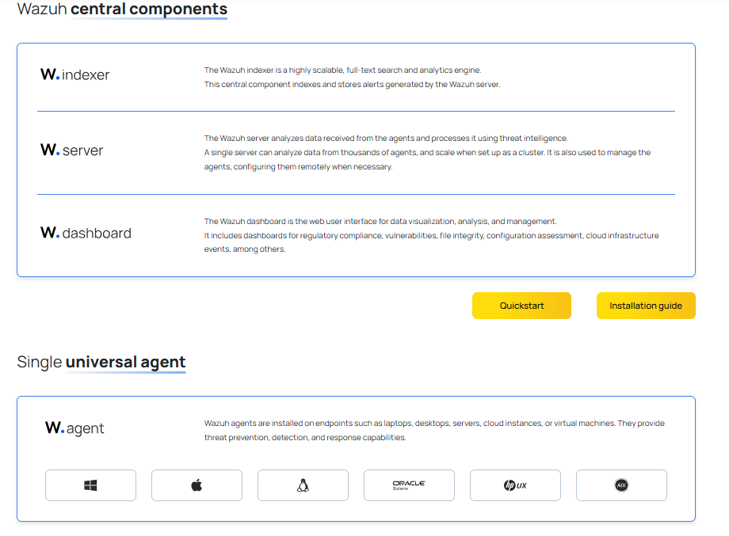

# Wazuh
Unifide XDR and SIEM protection for endpoints and cloud workloads

<p align="center">
<br/>
  
<br/>
<br/>
</p>


# Extended Detction Responce(XDR) & Endpoint (EP)
Is a system that collects Tlementary collection via Security Agents endpoints like server computers workstations and more.....
It uses these data and detect thread detection malicious activity By using behavior analysis & blocking malware

# Security Inforamtion & Event Detction(SIEM)
Is a system that collects Tlementary collection via Security Agents endpoints like server computers workstations and more.....
Its focus on more analysis and log aggregation vulnerability detection thread detection Security Monitoring and compilence Alerting & notification Configuration assessement.

# Configuration & Installtion
- Virtual Machine (OVA)\
```
https://documentation.wazuh.com/current/deployment-options/virtual-machine/virtual-machine.html
```
 # <- Download ->
```
https://packages.wazuh.com/4.x/vm/wazuh-4.12.0.ova
```
and then go to vb & start importing do it & start the server.

# agent deployment (linux.)
- step 1
```
sudo curl -O https://packages.wazuh.com/4.x/apt/pool/main/w/wazuh-agent/wazuh-agent_4.12.0-1_amd64.deb
```
```
sudo dpkg -i wazuh-agent_4.12.0-1_amd64.deb
```
```
sudo systemctl enable wazuh-agent
sudo systemctl start wazuh-agent
```
1. Check Service Status
Run:
```sudo systemctl status wazuh-agent.service```
This will show you the last log entries and the reason for the failure.

2. Review Detailed Logs
Run:
```sudo journalctl -xeu wazuh-agent.service```

3. Edit the Agent Configuration
Open the Wazuh agent configuration file:
```sudo nano /var/ossec/etc/ossec.conf ```
Look for the <server> block. It should look like this:
xml
<server>
  <address>ip_addr</address>
</server>
# check Status 
``` sudo systemctl status wazuh-agent ```

